# DreamLend Architecture Diagram Generation Prompt

## Overview

Generate a professional, presentation-style architectural diagram for **DreamLend**, a decentralized P2P lending protocol built on Somnia L1. Create a visual diagram (not code) that shows the complete system architecture with boxes, arrows, and clear component relationships. The diagram should be clean, modern, and suitable for technical presentations, investor pitch decks, and documentation.

## Title & Branding

- **Main Title**: "🏗️ DreamLend Architecture"
- **Subtitle**: "Decentralized P2P Lending Protocol on Somnia L1"
- **Footer**: "🌐 dreamlend.finance | 🐦 @DreamlendFi | Built for Somnia L1"

## Layer Structure (Top to Bottom)

### 1. User Layer 👥

**Background Color**: Light teal (#e6fffa)
**Border**: Teal (#38b2ac)

**Components**:

- **🏦 Lenders**: "Create Offers" - Users who provide loan capital with custom terms
- **💰 Borrowers**: "Accept Loans" - Users who take loans by providing collateral
- **⚡ Liquidators**: "Monitor Health" - Users who liquidate unhealthy loans for profit

### 2. Frontend Layer 🖥️

**Background Color**: Light blue (#ebf8ff)
**Border**: Blue (#3182ce)
**Title**: "Frontend Layer (Next.js)"

**Components**:

- **📱 Next.js App**: "React Interface" - Modern web application
- **🎣 Custom Hooks**: "useP2PLending, useSubgraphQuery, useLivePriceComparison" - React state management
- **🧩 Components**: "TransactionModal, LoanHealthManager, TokenSelector" - Reusable UI components
- **💳 Wallet Integration**: "Reown AppKit" - Web3 wallet connection
- **📊 The Graph Subgraph**: "Data Indexing & Caching" - Blockchain data indexing

### 3. Blockchain Layer ⛓️

**Background Color**: Light purple (#faf5ff)
**Border**: Purple (#805ad5)
**Title**: "Somnia L1 Blockchain"
**Subtitle**: "Chain ID: 50312 | 400k+ TPS"

**Smart Contracts**:

- **🏛️ DreamLend**: "Main Protocol"

  - Address: `0xddDa4e2B1B8E6f06086F103dA6358E7aCbd020ec`
  - Description: Core lending logic, loan management, and liquidations

- **🎁 RewardsDistributor**: "$DREAM Mining"

  - Address: `0x1ee1E4d84636FFDb8de6Dc684475C8f2Bdf5699c`
  - Description: Liquidity mining rewards in $DREAM tokens

- **💎 DreamerToken ($DREAM)**: "Governance Token"

  - Address: `0xf68F7B7FD9629f4990A5AB7181C2EE0E8b496B4B`
  - Description: Protocol governance and reward token

- **🪙 Mock Tokens**: "MUSDT, MUSDC, MWBTC, MARB, MSOL"
  - Description: Test tokens for Somnia L1 testnet

### 4. Oracle Infrastructure 🔮

**Background Color**: Light orange (#fffaf0)
**Border**: Orange (#dd6b20)

**Components**:

- **🔮 DIA Oracle V2**: "Price Feeds"

  - Address: `0x9206296Ea3aEE3E6bdC07F7AaeF14DfCf33d865D`
  - Description: Real-time price feeds for all supported tokens

- **📊 Price Feeds**: "USDT, USDC, BTC, ARB, SOL Feeds"
  - USDT: `0x67d2C2a87A17b7267a6DBb1A59575C0E9A1D1c3e`
  - USDC: `0x235266D5ca6f19F134421C49834C108b32C2124e`
  - BTC: `0x4803db1ca3A1DA49c3DB991e1c390321c20e1f21`
  - ARB: `0x74952812B6a9e4f826b2969C6D189c4425CBc19B`
  - SOL: `0xD5Ea6C434582F827303423dA21729bEa4F87D519`

## Data Flow Section 🔄

**Title**: "Data Flow & Interactions"
**Background**: Light gray (#f7fafc)

**6-Step Process Flow** (Left to Right):

1. **User Interaction**: "Create/Accept Loans" - Users initiate transactions
2. **Frontend Processing**: "Validation & UI Updates" - Form validation and state management
3. **Smart Contract**: "Execute Transaction" - Blockchain transaction execution
4. **Oracle Check**: "Price Validation" - Real-time price feed verification
5. **Event Emission**: "Blockchain Events" - Smart contract events emitted
6. **Subgraph Index**: "Data Caching" - The Graph indexes and caches data

## Network Information

- **Chain**: Somnia L1 Testnet
- **Chain ID**: 50312
- **RPC URL**: `https://dream-rpc.somnia.network`
- **Explorer**: `https://shannon-explorer.somnia.network/txs`
- **TPS**: 400k+
- **Subgraph Endpoint**: `https://api.subgraph.somnia.network/api/public/d5671b32-2846-489e-a577-e7d9702dd17b/subgraphs/dreamlend-graph/v0.0.3/`

## Key Features to Highlight

- **Collateral-Backed Security**: Every loan secured with over-collateralization
- **Lightning Fast**: Built on Somnia L1 for instant transactions
- **Real-Time Pricing**: Live oracle feeds for accurate valuations
- **Flexible Management**: Partial repayments and dynamic collateral
- **Liquidity Mining**: Earn $DREAM tokens for participation
- **Risk Management**: Advanced liquidation protection

## Visual Design Requirements

### Style Guidelines:

- **Professional & Clean**: Suitable for business presentations
- **Color-coded Layers**: Each layer has distinct background colors
- **Component Boxes**: White background with subtle borders
- **Typography**: Clear, readable fonts (Arial/Helvetica family)
- **Icons**: Use emojis for visual appeal and quick recognition
- **Arrows**: Show data flow between layers and components

### Layout:

- **Horizontal Flow**: User Layer → Frontend Layer → Blockchain Layer
- **Vertical Oracle**: Oracle layer below blockchain
- **Data Flow**: Horizontal process flow at bottom
- **Responsive**: Should work well in presentations and documents

### Technical Specifications:

- **Format**: Visual diagram (PNG/JPG/SVG) - NOT code
- **Dimensions**: Landscape orientation, suitable for presentations
- **Colors**: Use hex colors provided for consistency
- **Text**: Clear, readable fonts with hierarchical sizing
- **Layout**: Professional boxes and arrows showing relationships
- **Quality**: High resolution, presentation-ready

## Diagram Generation Instructions

**IMPORTANT**: Generate an actual visual diagram, not HTML/SVG code. The output should be a picture/image that shows:

1. **Layered Architecture**: 4 distinct horizontal layers with colored backgrounds
2. **Component Boxes**: White rectangular boxes within each layer
3. **Connecting Arrows**: Clear arrows showing data flow between layers
4. **Professional Layout**: Clean, business-presentation style
5. **All Text Visible**: Component names, addresses, and descriptions clearly readable

## Use Cases

This diagram should be suitable for:

- **Investor Presentations**: Clear value proposition and technical architecture
- **Technical Documentation**: Detailed component relationships
- **Developer Onboarding**: Understanding system architecture
- **Marketing Materials**: Professional representation of the protocol
- **Academic Papers**: Technical system overview

## Additional Context

DreamLend is the **first P2P lending protocol on Somnia L1**, featuring:

- Oracle-powered liquidations for fair pricing
- Liquidity mining rewards to incentivize participation
- Advanced risk management with volatility-based parameters
- Seamless UX with modern React interface
- 100% on-chain core functionality with off-chain data indexing

The protocol leverages Somnia L1's high throughput (400k+ TPS) and low fees to make DeFi lending accessible and efficient for all users.

## Tool-Specific Instructions

### For AI Image Generators (DALL-E, Midjourney, Stable Diffusion):

"Create a professional software architecture diagram showing a 4-layer system: User Layer (teal), Frontend Layer (blue), Blockchain Layer (purple), and Oracle Layer (orange). Each layer contains white rectangular boxes with component names. Show arrows connecting the layers. Include the title 'DreamLend Architecture' and subtitle 'Decentralized P2P Lending Protocol on Somnia L1'. Make it look like a business presentation slide."

### For Diagram Tools (Lucidchart, Draw.io, Visio):

Use this prompt as a specification to manually create the diagram with the exact components, colors, and layout described above.

### For Mermaid Diagram Code:

```mermaid
graph TB
    subgraph "👥 User Layer"
        A[🏦 Lenders<br/>Create Offers]
        B[💰 Borrowers<br/>Accept Loans]
        C[⚡ Liquidators<br/>Monitor Health]
    end

    subgraph "🖥️ Frontend Layer"
        D[📱 Next.js App<br/>React Interface]
        E[🎣 Custom Hooks<br/>useP2PLending]
        F[🧩 Components<br/>TransactionModal]
        G[💳 Wallet Integration<br/>Reown AppKit]
        H[📊 The Graph Subgraph<br/>Data Indexing]
    end

    subgraph "⛓️ Somnia L1 Blockchain"
        I[🏛️ DreamLend<br/>0xddDa4e2B1B8E6f06...]
        J[🎁 Rewards<br/>0x1ee1E4d84636FF...]
        K[💎 DREAM Token<br/>0xf68F7B7FD9629f49...]
        L[🪙 Mock Tokens<br/>MUSDT, MUSDC, etc.]
    end

    subgraph "🔮 Oracle Infrastructure"
        M[🔮 DIA Oracle V2<br/>0x9206296Ea3aEE3E6...]
        N[📊 Price Feeds<br/>USDT, USDC, BTC, ARB, SOL]
    end

    A --> D
    B --> D
    C --> D
    D --> I
    E --> I
    F --> I
    G --> I
    H --> I
    I --> M
    J --> M
    K --> M
    L --> M
```

### For ChatGPT/Claude:

Use this entire prompt and request: "Generate a visual description that I can use to create this architecture diagram" or "Create a detailed specification for a graphic designer to build this diagram."
