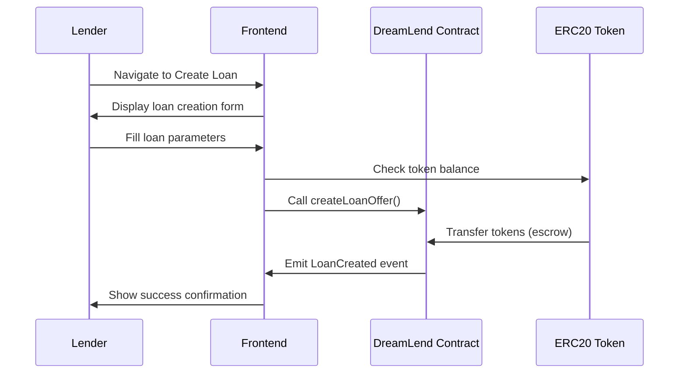
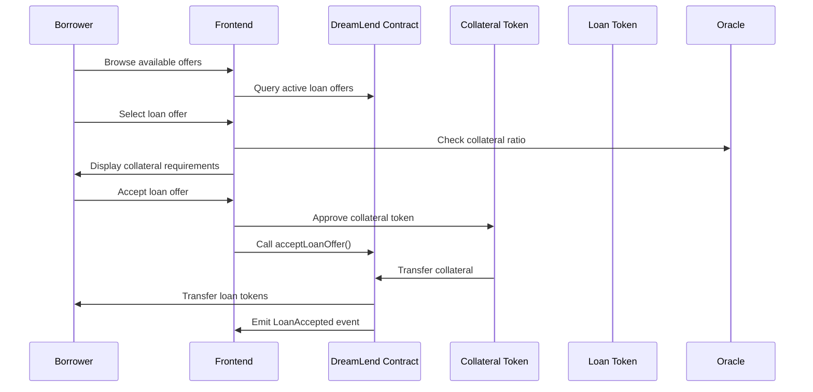
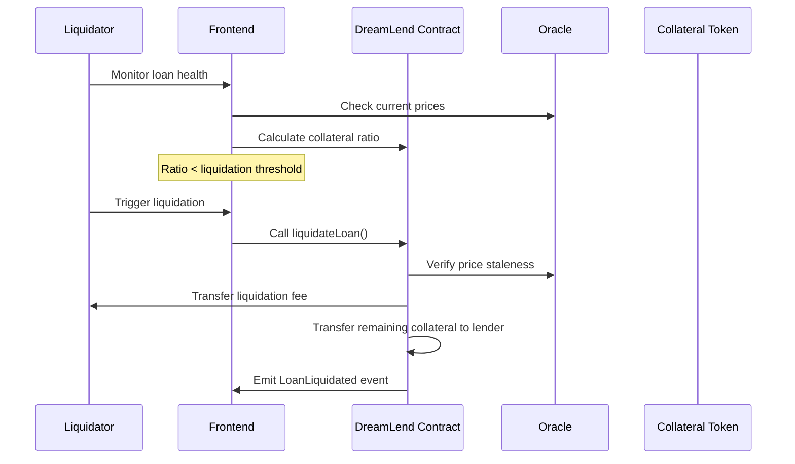

# DreamLend Protocol Architecture

## System Overview

DreamLend is a decentralized P2P lending protocol built on Somnia L1 testnet, featuring collateralized loans, oracle-based liquidations, and liquidity mining rewards.

```mermaid
graph TB
    %% User Layer
    subgraph "👥 User Layer"
        U1[Lenders]
        U2[Borrowers]
        U3[Liquidators]
    end

    %% Frontend Layer
    subgraph "🖥️ Frontend Layer (Next.js)"
        subgraph "📱 Pages"
            P1[Create Loan Page]
            P2[Offers Page]
            P3[My Loans Page]
            P4[Loan Details Page]
            P5[Analytics Page]
            P6[Rewards Page]
        end

        subgraph "🎣 Hooks & State"
            H1[useP2PLending]
            H2[useSubgraphQuery]
            H3[useTokenPrices]
            H4[useRewards]
            H5[useLivePriceComparison]
        end

        subgraph "🧩 Components"
            C1[TransactionModal]
            C2[LoanHealthManager]
            C3[PartialRepaymentManager]
            C4[TokenSelector]
        end
    end

    %% API Layer
    subgraph "🔌 API Layer"
        API1[/api/subgraph]
        API2[/api/loan-details]
    end

    %% Blockchain Layer
    subgraph "⛓️ Somnia L1 Testnet"
        subgraph "📋 Smart Contracts"
            SC1[DreamLend.sol<br/>Main Protocol Contract]
            SC2[RewardsDistributor.sol<br/>Liquidity Mining]
            SC3[DreamerToken.sol<br/>$DREAM Token]
            SC4[SomniaConfig.sol<br/>Configuration Library]
            SC5[MockTokens.sol<br/>Test Tokens]
        end

        subgraph "🪙 ERC20 Tokens"
            T1[MUSDT - Mock USDT]
            T2[MUSDC - Mock USDC]
            T3[MWBTC - Mock WBTC]
            T4[MARB - Mock ARB]
            T5[MSOL - Mock SOL]
        end
    end

    %% Oracle Layer
    subgraph "🔮 Oracle Infrastructure"
        O1[DIA Oracle V2<br/>0x9206296Ea3aEE3E6bdC07F7AaeF14DfCf33d865D]

        subgraph "📊 Price Feeds (AggregatorV3Interface)"
            PF1[USDT Feed<br/>0x67d2C2a87A17b7267a6DBb1A59575C0E9A1D1c3e]
            PF2[USDC Feed<br/>0x235266D5ca6f19F134421C49834C108b32C2124e]
            PF3[BTC Feed<br/>0x4803db1ca3A1DA49c3DB991e1c390321c20e1f21]
            PF4[ARB Feed<br/>0x74952812B6a9e4f826b2969C6D189c4425CBc19B]
            PF5[SOL Feed<br/>0xD5Ea6C434582F827303423dA21729bEa4F87D519]
        end
    end

    %% Data Layer
    subgraph "📊 Data Infrastructure"
        SG[The Graph Subgraph<br/>Event Indexing & Querying]
        CACHE[Frontend Cache<br/>Stale-While-Revalidate]
    end

    %% Wallet Layer
    subgraph "👛 Wallet Integration"
        W1[AppKit/WalletConnect]
        W2[MetaMask/Browser Wallets]
    end

    %% User Interactions
    U1 --> P1
    U1 --> P3
    U2 --> P2
    U2 --> P3
    U2 --> P4
    U3 --> P3

    %% Frontend Flow
    P1 --> H1
    P2 --> H1
    P3 --> H1
    P4 --> H1
    P5 --> H2
    P6 --> H4

    H1 --> C1
    H1 --> W1
    P4 --> C2
    P4 --> C3
    P1 --> C4

    H2 --> API1
    H3 --> O1
    H4 --> SC2
    H5 --> H3

    %% API Connections
    API1 --> SG
    API2 --> SC1

    %% Smart Contract Interactions
    H1 --> SC1
    SC1 --> SC2
    SC1 --> SC4
    SC2 --> SC3
    SC1 --> T1
    SC1 --> T2
    SC1 --> T3
    SC1 --> T4
    SC1 --> T5

    %% Oracle Connections
    SC1 --> PF1
    SC1 --> PF2
    SC1 --> PF3
    SC1 --> PF4
    SC1 --> PF5
    PF1 --> O1
    PF2 --> O1
    PF3 --> O1
    PF4 --> O1
    PF5 --> O1

    %% Data Flow
    SC1 --> SG
    H2 --> CACHE

    %% Wallet Connections
    W1 --> W2
    H1 --> W2

    %% Styling
    classDef userClass fill:#e1f5fe,stroke:#01579b,stroke-width:2px
    classDef frontendClass fill:#f3e5f5,stroke:#4a148c,stroke-width:2px
    classDef contractClass fill:#e8f5e8,stroke:#1b5e20,stroke-width:2px
    classDef oracleClass fill:#fff3e0,stroke:#e65100,stroke-width:2px
    classDef dataClass fill:#fce4ec,stroke:#880e4f,stroke-width:2px
    classDef walletClass fill:#f1f8e9,stroke:#33691e,stroke-width:2px

    class U1,U2,U3 userClass
    class P1,P2,P3,P4,P5,P6,H1,H2,H3,H4,H5,C1,C2,C3,C4,API1,API2 frontendClass
    class SC1,SC2,SC3,SC4,SC5,T1,T2,T3,T4,T5 contractClass
    class O1,PF1,PF2,PF3,PF4,PF5 oracleClass
    class SG,CACHE dataClass
    class W1,W2 walletClass
```

## Core Components

### 1. Smart Contract Layer

#### **DreamLend.sol** - Main Protocol Contract

- **Core Functions:**

  - `createLoanOffer()` - Lenders create loan offers with collateral requirements
  - `acceptLoanOffer()` - Borrowers accept offers by providing collateral
  - `repayLoan()` - Full loan repayment
  - `makePartialRepayment()` - Partial loan repayment
  - `liquidateLoan()` - Liquidate undercollateralized loans
  - `addCollateral()` / `removeCollateral()` - Collateral management

- **Key Features:**
  - Oracle-based collateral ratio monitoring
  - Automated liquidation triggers
  - Partial repayment support
  - Gas-efficient loan offer management

#### **RewardsDistributor.sol** - Liquidity Mining

- **Functions:**
  - `startAccruingRewards()` - Begin reward accumulation
  - `stopAccruingRewards()` - End reward accumulation
  - `claimRewards()` - Claim accumulated DREAM tokens
  - Reward calculation based on active principal amounts

#### **DreamerToken.sol** - Protocol Token

- **Features:**
  - ERC20 governance/reward token ($DREAM)
  - 100M total supply
  - Owner-controlled distribution to RewardsDistributor

#### **SomniaConfig.sol** - Configuration Library

- **Provides:**
  - Supported token addresses and price feeds
  - Risk parameters (collateral ratios, liquidation thresholds)
  - Volatility-based parameter adjustments

### 2. Oracle Infrastructure

#### **DIA Oracle Integration**

- **Main Oracle:** `0x9206296Ea3aEE3E6bdC07F7AaeF14DfCf33d865D`
- **Price Feeds:** AggregatorV3Interface-compatible adapters
- **Supported Assets:** USDT, USDC, BTC, ARB, SOL
- **Features:**
  - Real-time price updates
  - Staleness detection
  - 18-decimal normalized pricing

### 3. Frontend Architecture

#### **Next.js Application Structure**

```
src/
├── app/                    # App Router pages
│   ├── create/            # Loan creation interface
│   ├── offers/            # Browse available offers
│   ├── my-loans/          # User's loan management
│   ├── analytics/         # Protocol analytics
│   └── api/               # API routes
├── hooks/                 # Custom React hooks
├── components/            # Reusable UI components
├── lib/                   # Utility libraries
└── context/               # React context providers
```

#### **Key Hooks & Data Flow**

- **useP2PLending:** Main contract interaction hook
- **useSubgraphQuery:** Cached subgraph data fetching
- **useTokenPrices:** Real-time oracle price integration
- **useLivePriceComparison:** Price change analysis
- **useRewards:** Liquidity mining data

### 4. Data Infrastructure

#### **The Graph Subgraph**

- **Purpose:** Index and query blockchain events
- **Endpoint:** `https://api.subgraph.somnia.network/api/public/.../dreamlend-graph/`
- **Features:**
  - Real-time event indexing
  - Complex query support
  - Historical data access

#### **Frontend Caching Strategy**

- **Stale-While-Revalidate:** Serve cached data while fetching updates
- **Cache Duration:** 3 minutes for loan data
- **Cache Invalidation:** Manual triggers after transactions

## User Flows

### 1. Lender Flow



### 2. Borrower Flow



### 3. Liquidation Flow



## Security Features

### 1. Smart Contract Security

- **ReentrancyGuard:** Prevents reentrancy attacks
- **SafeERC20:** Safe token transfers
- **Access Control:** Owner-only administrative functions
- **Input Validation:** Comprehensive parameter checking

### 2. Oracle Security

- **Price Staleness Checks:** Reject outdated price data
- **Multiple Price Feeds:** Diversified oracle sources
- **Liquidation Protection:** Prevent liquidation with stale prices

### 3. Frontend Security

- **Input Sanitization:** Clean user inputs
- **Transaction Validation:** Verify parameters before submission
- **Error Handling:** Graceful failure management
- **Wallet Integration:** Secure wallet connection via AppKit

## Performance Optimizations

### 1. Smart Contract Optimizations

- **Gas-Efficient Data Structures:** Optimized mappings and arrays
- **Batch Operations:** Efficient loan offer management
- **Event-Based Architecture:** Minimal on-chain storage

### 2. Frontend Optimizations

- **Caching Strategy:** Reduce redundant API calls
- **Parallel Data Fetching:** Concurrent price and loan data loading
- **Optimistic Updates:** Immediate UI feedback
- **Code Splitting:** Lazy-loaded components

### 3. Data Layer Optimizations

- **Subgraph Indexing:** Fast event querying
- **Pagination:** Efficient large dataset handling
- **Real-time Updates:** WebSocket connections for live data

## Deployment Architecture

### 1. Smart Contracts (Somnia L1 Testnet)

- **DreamLend:** Main protocol contract
- **RewardsDistributor:** Liquidity mining rewards
- **DreamerToken:** Protocol governance token
- **Mock Tokens:** Testing token contracts

### 2. Frontend (Vercel/Next.js)

- **Static Site Generation:** Pre-rendered pages
- **API Routes:** Server-side subgraph proxy
- **Edge Functions:** Global content delivery
- **Environment Variables:** Configuration management

### 3. Data Infrastructure

- **The Graph:** Decentralized indexing protocol
- **IPFS:** Metadata storage (future)
- **CDN:** Static asset delivery

## Future Enhancements

### 1. Protocol Features

- **Multi-collateral Loans:** Support multiple collateral types
- **Flash Loans:** Uncollateralized instant loans
- **Governance:** DAO-based protocol governance
- **Cross-chain:** Multi-chain deployment

### 2. Frontend Features

- **Mobile App:** React Native application
- **Advanced Analytics:** Comprehensive protocol metrics
- **Social Features:** Lender/borrower reputation system
- **Automated Strategies:** Yield farming automation

### 3. Infrastructure

- **Decentralized Frontend:** IPFS hosting
- **Layer 2 Integration:** Scaling solutions
- **MEV Protection:** Transaction privacy
- **Insurance:** Protocol insurance coverage

---

_This architecture supports a scalable, secure, and user-friendly P2P lending protocol with advanced features like oracle-based liquidations, liquidity mining rewards, and comprehensive risk management._
